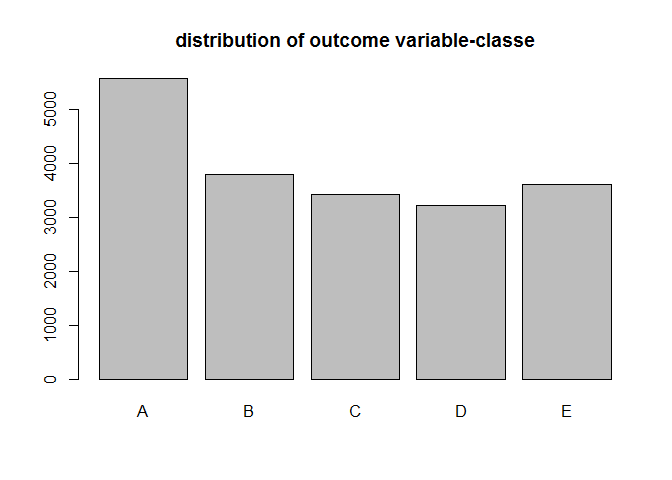
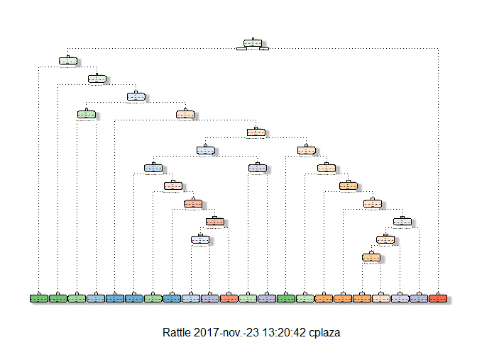

# Machine Learning Project


## Introduction

Using devices such as Jawbone Up, Nike FuelBand, and Fitbit it is now possible to collect a large amount of data about personal activity relatively inexpensively. One thing that people regularly do is quantify how much of a particular activity they do, but they rarely quantify how well they do it. 

In this project, the  goal will be to use data from accelerometers on the belt, forearm, arm, and dumbell of 6 participants in order to predict the manner in which they did the following exercise: they were asked to perform barbell lifts correctly and incorrectly in 5 different ways:

* exactly according to the specification (Class A), 
* throwing the elbows to the front (Class B), 
* lifting the dumbbell only halfway (Class C), 
* lowering the dumbbell only halfway (Class D) 
* and throwing the hips to the front (Class E).


## Model Design

The steps to complete the project are:

* Load the data and perform exploratory analysis of the data to select which variables are relevant for the prediction model.
* Split the data into different subsets for training and testing the model.
* Estimate the parameters of the model with the training dataset.
* Estimate the out of the sample error: apply the model to calculate the predicted outcomes for the testing dataset and
  compare these predicted values to the actual values of the dataset. This way the accuracy is estimated and so the error.
* Forecast the output for the additional data that is provided, as required in the project description.


### Exploratory data analysis and selection of explanatory variables


```r
library(caret)
library(rpart)    #Tree model
library(rattle)   #for drawing tree model
library(randomForest) #randomForest model

#for reproducibility
set.seed(284)
```

The data is read and the columns (variables) which are clearly not explanatory (timestamps, ids) are removed.
Also the variables whose values are not available for most of the observations.
Finally, we check whether there're variables with zero or near-zero variance in order to removed them.


```r
# the datasets have been downloaded previously and are available at the current working directory.
# from a visual inspection of the .csv files, there're many empty values , NA, and DIV/0. 
# we turn this data to "NA"
alldata = read.csv("pml-training.csv",na.strings=c("NA","#DIV/0!",""))
names(alldata)
```

```
##   [1] "X"                        "user_name"               
##   [3] "raw_timestamp_part_1"     "raw_timestamp_part_2"    
##   [5] "cvtd_timestamp"           "new_window"              
##   [7] "num_window"               "roll_belt"               
##   [9] "pitch_belt"               "yaw_belt"                
##  [11] "total_accel_belt"         "kurtosis_roll_belt"      
##  [13] "kurtosis_picth_belt"      "kurtosis_yaw_belt"       
##  [15] "skewness_roll_belt"       "skewness_roll_belt.1"    
##  [17] "skewness_yaw_belt"        "max_roll_belt"           
##  [19] "max_picth_belt"           "max_yaw_belt"            
##  [21] "min_roll_belt"            "min_pitch_belt"          
##  [23] "min_yaw_belt"             "amplitude_roll_belt"     
##  [25] "amplitude_pitch_belt"     "amplitude_yaw_belt"      
##  [27] "var_total_accel_belt"     "avg_roll_belt"           
##  [29] "stddev_roll_belt"         "var_roll_belt"           
##  [31] "avg_pitch_belt"           "stddev_pitch_belt"       
##  [33] "var_pitch_belt"           "avg_yaw_belt"            
##  [35] "stddev_yaw_belt"          "var_yaw_belt"            
##  [37] "gyros_belt_x"             "gyros_belt_y"            
##  [39] "gyros_belt_z"             "accel_belt_x"            
##  [41] "accel_belt_y"             "accel_belt_z"            
##  [43] "magnet_belt_x"            "magnet_belt_y"           
##  [45] "magnet_belt_z"            "roll_arm"                
##  [47] "pitch_arm"                "yaw_arm"                 
##  [49] "total_accel_arm"          "var_accel_arm"           
##  [51] "avg_roll_arm"             "stddev_roll_arm"         
##  [53] "var_roll_arm"             "avg_pitch_arm"           
##  [55] "stddev_pitch_arm"         "var_pitch_arm"           
##  [57] "avg_yaw_arm"              "stddev_yaw_arm"          
##  [59] "var_yaw_arm"              "gyros_arm_x"             
##  [61] "gyros_arm_y"              "gyros_arm_z"             
##  [63] "accel_arm_x"              "accel_arm_y"             
##  [65] "accel_arm_z"              "magnet_arm_x"            
##  [67] "magnet_arm_y"             "magnet_arm_z"            
##  [69] "kurtosis_roll_arm"        "kurtosis_picth_arm"      
##  [71] "kurtosis_yaw_arm"         "skewness_roll_arm"       
##  [73] "skewness_pitch_arm"       "skewness_yaw_arm"        
##  [75] "max_roll_arm"             "max_picth_arm"           
##  [77] "max_yaw_arm"              "min_roll_arm"            
##  [79] "min_pitch_arm"            "min_yaw_arm"             
##  [81] "amplitude_roll_arm"       "amplitude_pitch_arm"     
##  [83] "amplitude_yaw_arm"        "roll_dumbbell"           
##  [85] "pitch_dumbbell"           "yaw_dumbbell"            
##  [87] "kurtosis_roll_dumbbell"   "kurtosis_picth_dumbbell" 
##  [89] "kurtosis_yaw_dumbbell"    "skewness_roll_dumbbell"  
##  [91] "skewness_pitch_dumbbell"  "skewness_yaw_dumbbell"   
##  [93] "max_roll_dumbbell"        "max_picth_dumbbell"      
##  [95] "max_yaw_dumbbell"         "min_roll_dumbbell"       
##  [97] "min_pitch_dumbbell"       "min_yaw_dumbbell"        
##  [99] "amplitude_roll_dumbbell"  "amplitude_pitch_dumbbell"
## [101] "amplitude_yaw_dumbbell"   "total_accel_dumbbell"    
## [103] "var_accel_dumbbell"       "avg_roll_dumbbell"       
## [105] "stddev_roll_dumbbell"     "var_roll_dumbbell"       
## [107] "avg_pitch_dumbbell"       "stddev_pitch_dumbbell"   
## [109] "var_pitch_dumbbell"       "avg_yaw_dumbbell"        
## [111] "stddev_yaw_dumbbell"      "var_yaw_dumbbell"        
## [113] "gyros_dumbbell_x"         "gyros_dumbbell_y"        
## [115] "gyros_dumbbell_z"         "accel_dumbbell_x"        
## [117] "accel_dumbbell_y"         "accel_dumbbell_z"        
## [119] "magnet_dumbbell_x"        "magnet_dumbbell_y"       
## [121] "magnet_dumbbell_z"        "roll_forearm"            
## [123] "pitch_forearm"            "yaw_forearm"             
## [125] "kurtosis_roll_forearm"    "kurtosis_picth_forearm"  
## [127] "kurtosis_yaw_forearm"     "skewness_roll_forearm"   
## [129] "skewness_pitch_forearm"   "skewness_yaw_forearm"    
## [131] "max_roll_forearm"         "max_picth_forearm"       
## [133] "max_yaw_forearm"          "min_roll_forearm"        
## [135] "min_pitch_forearm"        "min_yaw_forearm"         
## [137] "amplitude_roll_forearm"   "amplitude_pitch_forearm" 
## [139] "amplitude_yaw_forearm"    "total_accel_forearm"     
## [141] "var_accel_forearm"        "avg_roll_forearm"        
## [143] "stddev_roll_forearm"      "var_roll_forearm"        
## [145] "avg_pitch_forearm"        "stddev_pitch_forearm"    
## [147] "var_pitch_forearm"        "avg_yaw_forearm"         
## [149] "stddev_yaw_forearm"       "var_yaw_forearm"         
## [151] "gyros_forearm_x"          "gyros_forearm_y"         
## [153] "gyros_forearm_z"          "accel_forearm_x"         
## [155] "accel_forearm_y"          "accel_forearm_z"         
## [157] "magnet_forearm_x"         "magnet_forearm_y"        
## [159] "magnet_forearm_z"         "classe"
```

```r
#remove columns that cannot be predictors (first 7 columns): "X","user_name","raw_timestamp_part_1","raw_timestamp_part_2"    
#"cvtd_timestamp","new_window","num_window" 
reduceddata <- alldata[, -c(1:7)]

#remove columns which a high number of #NA  values (>70%)
rate <- apply(reduceddata, 2, function(x) (sum(is.na(x))))/nrow(reduceddata)
reduceddata <- reduceddata[!(rate>0.7)]
length(reduceddata)
```

```
## [1] 53
```

```r
#check  if in there're  NearZeroVariance variables:
NZVdata <- nearZeroVar(reduceddata, saveMetrics=TRUE)  
sum(NZVdata$zeroVar == TRUE)
```

```
## [1] 0
```

```r
sum(NZVdata$nzv == TRUE)
```

```
## [1] 0
```
It seems there're no near-zero variance variables, so we will use the  variables selected after removing NAs as predictors.


```r
plot(reduceddata$classe, main="distribution of outcome variable-classe")
```

<!-- -->

The  plot shows the distribution of the outcome variable that has to be predicted. Every of the possible outcomes have several '000 samples.

### Model selection

The dataset is splitted intro training and testing subsets.


```r
#let's partition the dataset into training and testing: 70%-30%
train <- createDataPartition(y=reduceddata$classe,p=.70,list=F)
training <- reduceddata[train,]
testing <- reduceddata[-train,]
```

Since we want to predict which of the 5 groups "A"..."E" an observation is assigned to, we start with a **tree model**:

```r
modTree <- rpart(classe ~ ., data=training, method = "class")
fancyRpartPlot(modTree)
```

<!-- -->

```r
#check with test dataset
testingTree <- predict(modTree, newdata = testing, type = "class")

m1 <- confusionMatrix(testingTree, testing$classe)
m1
```

```
## Confusion Matrix and Statistics
## 
##           Reference
## Prediction    A    B    C    D    E
##          A 1476  240   69  105   86
##          B   37  658   70   26   71
##          C   52   98  667   49   40
##          D   32   58  192  707  128
##          E   77   85   28   77  757
## 
## Overall Statistics
##                                           
##                Accuracy : 0.7247          
##                  95% CI : (0.7131, 0.7361)
##     No Information Rate : 0.2845          
##     P-Value [Acc > NIR] : < 2.2e-16       
##                                           
##                   Kappa : 0.6499          
##  Mcnemar's Test P-Value : < 2.2e-16       
## 
## Statistics by Class:
## 
##                      Class: A Class: B Class: C Class: D Class: E
## Sensitivity            0.8817   0.5777   0.6501   0.7334   0.6996
## Specificity            0.8813   0.9570   0.9508   0.9167   0.9444
## Pos Pred Value         0.7470   0.7633   0.7362   0.6329   0.7393
## Neg Pred Value         0.9493   0.9042   0.9279   0.9461   0.9331
## Prevalence             0.2845   0.1935   0.1743   0.1638   0.1839
## Detection Rate         0.2508   0.1118   0.1133   0.1201   0.1286
## Detection Prevalence   0.3358   0.1465   0.1540   0.1898   0.1740
## Balanced Accuracy      0.8815   0.7674   0.8005   0.8250   0.8220
```

```r
acc1 <- m1$overall['Accuracy']
```

The accuracy of the model is 0.7247239.

If we compare to a **Random Forest model** -computationally more demanding but improves accuracy-, we get the following results:


```r
modFitRF <- randomForest(classe ~ ., data=training, method="class")
testingRF <- predict(modFitRF, newdata = testing, type = "class")
m2 <- confusionMatrix(testingRF, testing$classe)
m2
```

```
## Confusion Matrix and Statistics
## 
##           Reference
## Prediction    A    B    C    D    E
##          A 1668    6    0    0    0
##          B    3 1133    8    0    0
##          C    3    0 1018   11    3
##          D    0    0    0  953    3
##          E    0    0    0    0 1076
## 
## Overall Statistics
##                                           
##                Accuracy : 0.9937          
##                  95% CI : (0.9913, 0.9956)
##     No Information Rate : 0.2845          
##     P-Value [Acc > NIR] : < 2.2e-16       
##                                           
##                   Kappa : 0.992           
##  Mcnemar's Test P-Value : NA              
## 
## Statistics by Class:
## 
##                      Class: A Class: B Class: C Class: D Class: E
## Sensitivity            0.9964   0.9947   0.9922   0.9886   0.9945
## Specificity            0.9986   0.9977   0.9965   0.9994   1.0000
## Pos Pred Value         0.9964   0.9904   0.9836   0.9969   1.0000
## Neg Pred Value         0.9986   0.9987   0.9984   0.9978   0.9988
## Prevalence             0.2845   0.1935   0.1743   0.1638   0.1839
## Detection Rate         0.2834   0.1925   0.1730   0.1619   0.1828
## Detection Prevalence   0.2845   0.1944   0.1759   0.1624   0.1828
## Balanced Accuracy      0.9975   0.9962   0.9944   0.9940   0.9972
```

```r
acc2 <- m2$overall['Accuracy']
```

The accuracy improves to 0.9937128, therefore the out-of-sample error is 0.0062872.

### Predictions


```r
#read the file with the input data for prediction and apply the same transformations as in the training data
preddata = read.csv("pml-testing.csv",na.strings=c("NA","#DIV/0!",""))

#remove columns that cannot be predictors (first 7 columns): "X","user_name","raw_timestamp_part_1","raw_timestamp_part_2"    
#"cvtd_timestamp","new_window","num_window" 
reduceddata2 <- preddata[, -c(1:7)]

#remove columns which a high number of #NA  values (>70%)
reduceddata2 <- reduceddata2[!(rate>0.7)]

# use the most accurate model (Random Forest)
predictions <- predict(modFitRF, newdata = reduceddata2, type = "class")
predictions
```

```
##  1  2  3  4  5  6  7  8  9 10 11 12 13 14 15 16 17 18 19 20 
##  B  A  B  A  A  E  D  B  A  A  B  C  B  A  E  E  A  B  B  B 
## Levels: A B C D E
```

